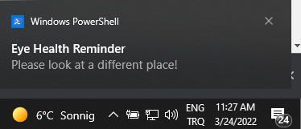

# eye-notifier-go

This CLI app reminds with a  [beeep](https://github.com/gen2brain/beeep) sound. to look at different place without digital screen to protect eye health.




## Build

```bash
  go build main.go
```

## Run

```bash
  go run main.go
```
    
    

## ToDo
- Run as daemon
